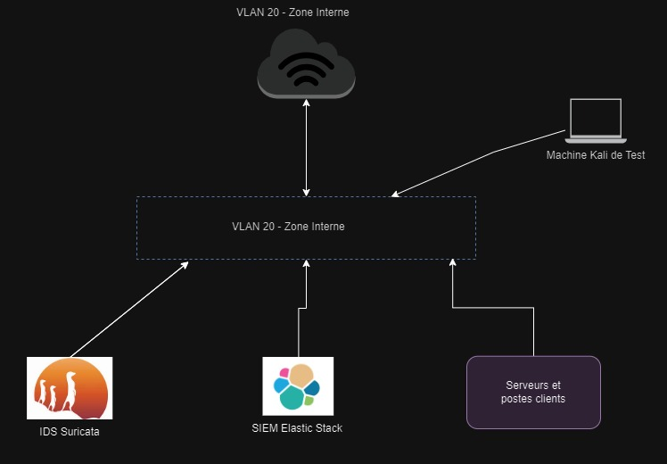

# Projet IDS/SIEM - Suricata avec Elastic Stack

## 📋 Description du Projet
Mise en œuvre d'une solution de détection d'intrusion (IDS) Suricata couplée à un SIEM Elastic Stack pour une société industrielle utilisant des robots contrôlés à distance.

Le projet vise à :
- Détecter les tentatives d'intrusion
- Assurer une surveillance continue du réseau
- Qualifier et analyser les événements de sécurité
- Maintenir la conformité réglementaire

## 👥 Équipe
### Blue Team
- Chef de Projet : Modou Ndiar DIA
- Installation Suricata : Anthony, Leslie
- Configuration Elastic Stack : Brahim, Amine

### Red Team
- Tests de pénétration : Oussama,  Mostafa

## Architecture

### Composants

- IDS : Suricata
- SIEM : Elastic Stack (Elasticsearch, Kibana, Logstash, Beats)
- Plateforme de test : Kali Linux

### Configuration Matérielle Requise
- VirtualBox/VMware
- Minimum 16GB RAM sur l'hôte
- 140GB espace disque disponible

### Configuration des VMs
- Firewall/Router : 2 CPU, 2GB RAM
- Suricata IDS : 2 CPU, 4GB RAM
- Elastic Stack : 2 CPU, 8GB RAM
- Kali Linux : 2 CPU, 4GB RAM

## 🎯 Objectifs
1. Détection des intrusions
   - Base de signatures
   - Analyse comportementale
2. Surveillance continue
   - Acquisition automatique des flux
   - Analyse en temps réel
3. Gestion des incidents
   - Transmission des alertes vers le SIEM
   - Qualification des événements
4. Conformité réglementaire
   - Documentation des procédures
   - Traçabilité des actions

## Structure du Projet
📁 Project Root
├── 📁 docs/
│ ├── 📄 installation.md
│ ├── 📄 configuration.md
│ └── 📄 tests.md
├── 📁 config/
│ ├── 📁 suricata/
│ └── 📁 elastic/
├── 📁 scripts/
│ ├── 📁 setup/
│ └── 📁 tests/
└── 📁 results/
└── 📁 test-reports/

## 🚀 Installation
Voir [Guide d'installation](docs/installation.md)

## Configuration
Voir [Guide de configuration](docs/configuration.md)

## Tests
Voir [Guide des tests](docs/tests.md)

## Plan de Test
Voir [Guide des tests](docs/plan_de_test.md)

## Planning
Voir [Guide des tests](docs/planning.md)

## Livrables

### Documentation Technique
- [ ] Architecture détaillée
  - Schémas techniques
  - Documentation réseau
  - Configurations détaillées

- [ ] Procédures d'installation
  - Guide pas à pas
  - Scripts d'automatisation
  - Documentation de maintenance

### Documentation des Tests
- [ ] Plan de test complet
  - Scénarios de test
  - Critères de validation
  - Métriques de performance

- [ ] Rapports de tests
  - Résultats détaillés
  - Analyse des performances
  - Recommandations

### Présentation Finale
- [ ] Support de présentation
  - Slides techniques
  - Démonstration live
  - Scénarios d'attaque

- [ ] Documentation
  - Guide utilisateur
  - Manuel administrateur
  - Procédures d'urgence

## Sécurité et Bonnes Pratiques

### Sécurité
- Ne jamais commiter de credentials
- Utiliser des variables d'environnement
- Chiffrer les données sensibles

### Documentation
- Mettre à jour la documentation après chaque changement
- Documenter les incidents et solutions
- Maintenir un changelog

## Ressources et Documentation

### Documentation Officielle
- [Suricata Documentation](https://suricata.readthedocs.io/)
- [Elastic Stack Documentation](https://www.elastic.co/guide/index.html)
- [Kali Linux Tools](https://tools.kali.org/)

## Contact

### Support et Assistance
- Chef de Projet : modou-ndiar.dia@efrei.net
- Support Technique : support.technique@projet-ids.com

## Licence
Ce projet est sous licence MIT.

---
*Dernière mise à jour : 13 Novembre 2024*